# LuminRAG — Code Logic & Data Flow

This document explains how every file in the codebase works and how they connect to each other. Each section starts with a plain-English summary followed by a flowchart.

---

## Table of Contents

1. [High-level overview](#1-high-level-overview)
2. [Ingestion — how course content gets in](#2-ingestion)
   - [Video](#21-video-mp4-mkv-mov-avi)
   - [Audio](#22-audio-mp3-wav-m4a-etc)
   - [PDF (text)](#23-pdf-text--textbook--lecture-notes)
   - [PDF (slides)](#24-pdf-slides)
   - [Image](#25-image-jpg-png-webp)
3. [Query pipeline — how questions get answered](#3-query-pipeline)
4. [Graph construction — how the knowledge graph is built](#4-graph-construction)
5. [File-by-file reference](#5-file-by-file-reference)
6. [Dependency map — who calls whom](#6-dependency-map)

---

## 1. High-level overview

The system has two independent phases: **ingestion** (run once, offline) and **query** (runs on every user question).

```
┌─────────────────────────────────────────────────────────┐
│  INGESTION PHASE  (run once via UI upload or CLI)        │
│                                                         │
│  Raw files → Chunks → SQLite + FAISS index + Graph JSON │
└─────────────────────────────────────────────────────────┘
                          ↓  stored data
┌─────────────────────────────────────────────────────────┐
│  QUERY PHASE  (runs on every user question)              │
│                                                         │
│  Question → Router → Retrieve → Reflect → Generate      │
│                                        → Answer + hops  │
└─────────────────────────────────────────────────────────┘
```

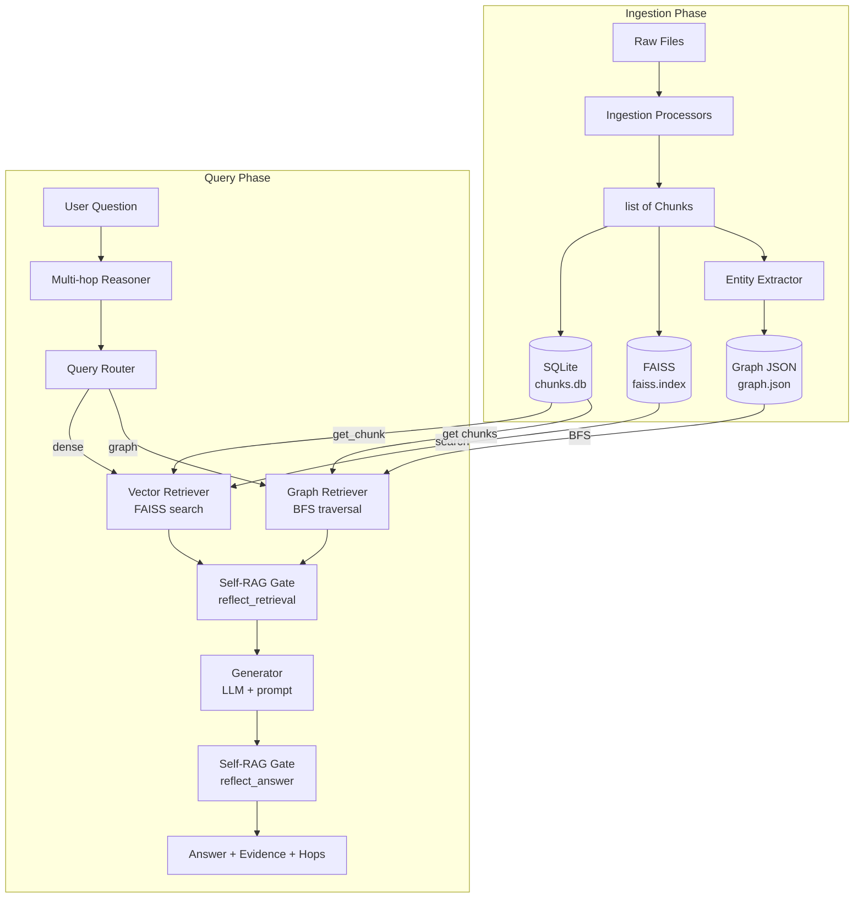

---

## 2. Ingestion

All ingestion processors share the same output type: `list[Chunk]`. A `Chunk` is defined in `schemas.py` and contains the text, source file name, modality (video/slide/pdf/image/audio), and metadata like page number or timestamp.

Once any processor produces chunks, the same three things always happen:
1. Chunks are saved to **SQLite** (`document_store.py`)
2. Chunks are embedded and saved to **FAISS** (`vector_retriever.py`)
3. Triples are extracted from chunks and added to the **concept graph** (`entity_extractor.py` → `graph_builder.py`)

### 2.1 Video (`.mp4`, `.mkv`, `.mov`, `.avi`)

**File:** `backend/ingestion/video_transcriber.py`  
**Entry point:** `transcribe_video(video_path, config) → list[Chunk]`

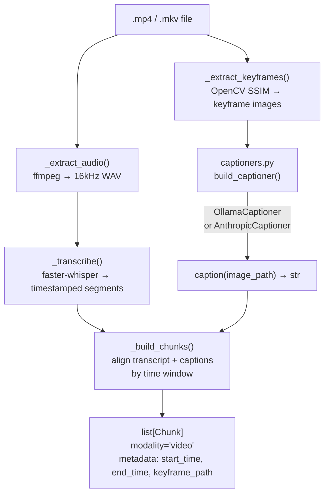

**How keyframe extraction works:** OpenCV samples one frame per second and compares each frame to the previous using SSIM (structural similarity). When the score drops below `ssim_threshold` (default 0.85), a new keyframe is saved. This detects slide changes in screen-recorded lectures.

---

### 2.2 Audio (`.mp3`, `.wav`, `.m4a`, etc.)

**File:** `backend/ingestion/audio_processor.py`  
**Entry point:** `process_audio(audio_path, config) → list[Chunk]`

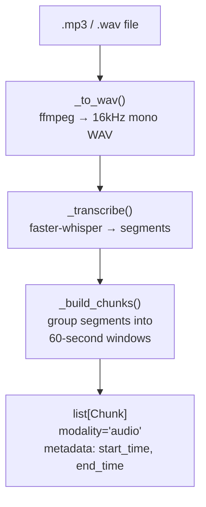

Same Whisper transcription as video but skips keyframe extraction since there is no visual channel.

---

### 2.3 PDF (text — textbook / lecture notes)

**File:** `backend/ingestion/pdf_processor.py`  
**Entry point:** `process_pdf(pdf_path, config) → list[Chunk]`

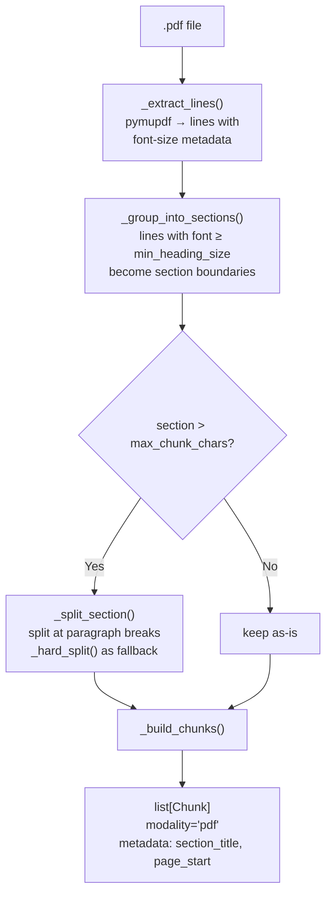

**Key design choice:** Chunks follow the document's own heading structure rather than fixed token windows. A font size ≥ `min_heading_size` (default 14pt) signals a new section.

---

### 2.4 PDF (slides)

**File:** `backend/ingestion/slide_processor.py`  
**Entry point:** `process_slides(pdf_path, config) → list[Chunk]`

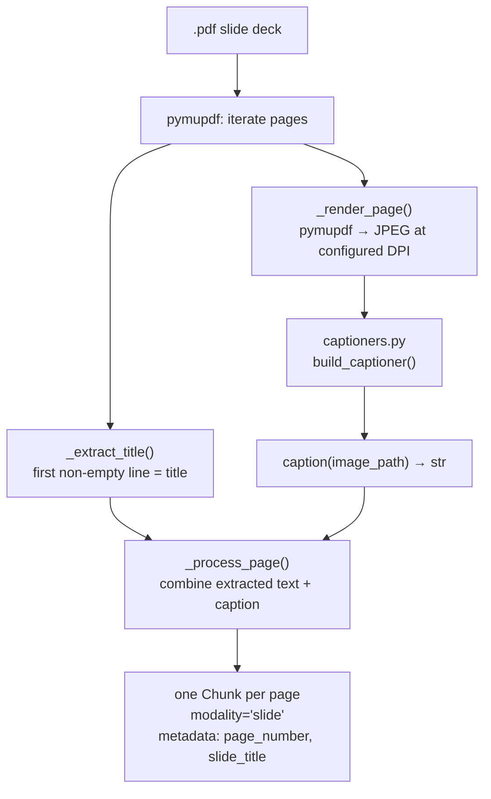

Unlike the text PDF processor, every page becomes exactly one chunk. The LLM generates a natural-language description of each slide image rather than relying solely on raw text extraction.

---

### 2.5 Image (`.jpg`, `.png`, `.webp`)

**File:** `backend/ingestion/image_processor.py`  
**Entry point:** `process_image(image_path, config) → list[Chunk]`

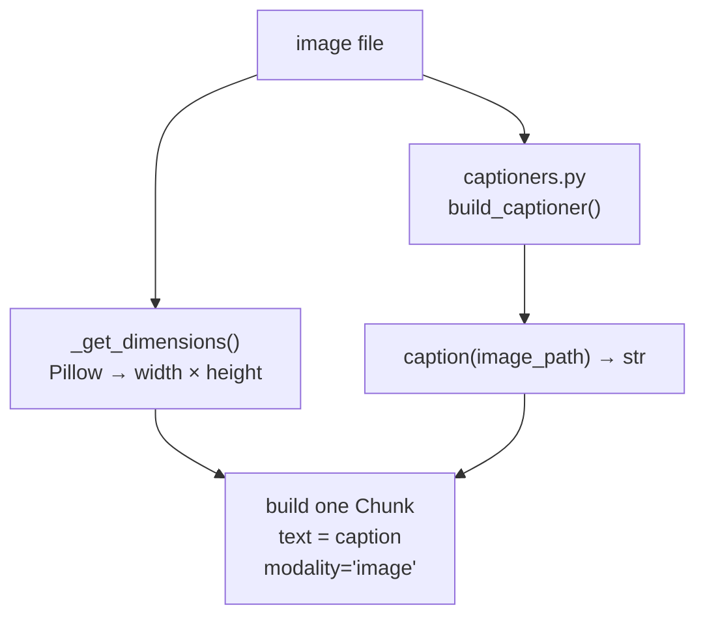

---

### Captioners (shared by video, slides, images)

**File:** `backend/ingestion/captioners.py`  
**Factory:** `build_captioner(cfg) → BaseCaptioner`

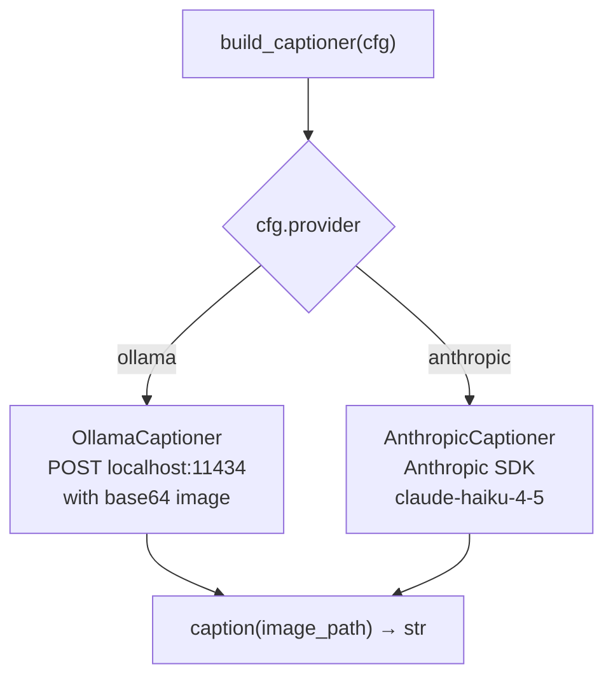

---

## 3. Query Pipeline

Every user question travels through this exact sequence regardless of complexity.

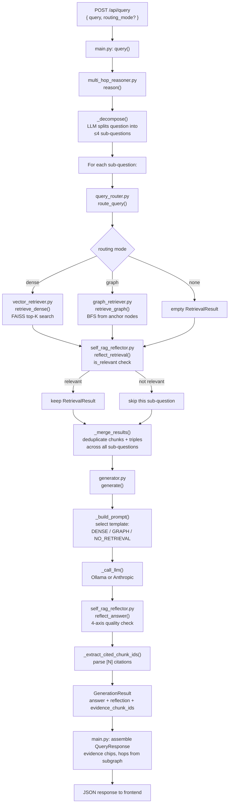

### Query routing logic

**File:** `backend/retrieval/query_router.py`  
**Function:** `route_query(question, config) → "dense" | "graph" | "none"`

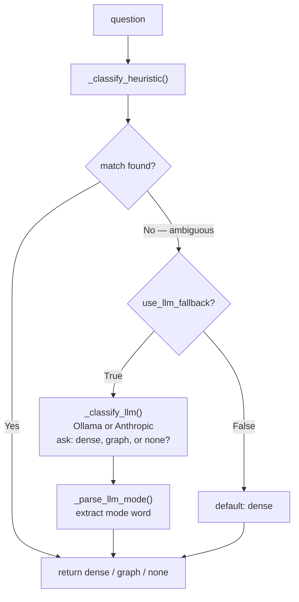

**Heuristic signals:**
- **dense** — "What is", "Define", "Who", "When", "Where", "List", "Name"
- **graph** — "Why", "How does", "Explain", "Compare", "relationship between", "difference between", "affects"
- **none** — greetings, fewer than 3 content words

### Graph retrieval — how BFS works

**File:** `backend/retrieval/graph_retriever.py`  
**Function:** `retrieve_graph(query, builder, store, embedder, config) → RetrievalResult`

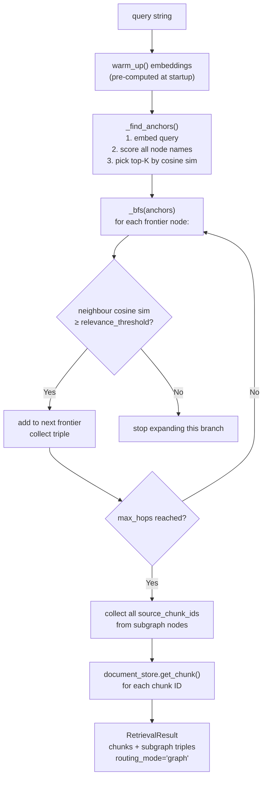

---

## 4. Graph Construction

The concept graph is built during ingestion. It is updated incrementally — each new upload adds nodes and edges to the existing graph without rebuilding from scratch.

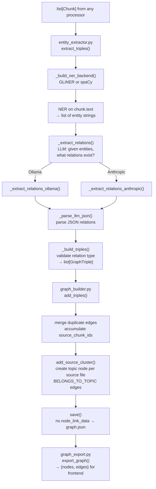

**Valid relation types:** `PART_OF`, `PREREQUISITE`, `CAUSES`, `EXAMPLE_OF`, `EXPLAINS`, `BELONGS_TO_TOPIC`

**Node key convention:** `name.strip().lower()` — e.g., "Enzyme Kinetics" → `"enzyme kinetics"`. This same key is used in the `hops` array returned by the API and in the frontend graph highlighting.

---

## 5. File-by-file reference

### Core

| File | What it does | Key exports |
|------|-------------|-------------|
| `backend/schemas.py` | Defines every shared data model. Every module imports from here. | `Chunk`, `GraphTriple`, `RetrievalResult`, `ReflectionVerdict`, `GenerationResult` |
| `backend/main.py` | FastAPI app. Holds singleton state (store, embedder, index, graph). Orchestrates query and ingest endpoints. | 5 endpoints, `_AppState` |
| `backend/__main__.py` | Runs uvicorn on port 8000 with reload. Loads `.env` before importing anything. | — |

### Ingestion layer

| File | What it does | Input → Output |
|------|-------------|----------------|
| `ingestion/video_transcriber.py` | Whisper transcription + SSIM keyframe extraction + LLM captioning | `.mp4/.mkv` → `list[Chunk]` |
| `ingestion/audio_processor.py` | Whisper transcription grouped into 60s windows | `.mp3/.wav` → `list[Chunk]` |
| `ingestion/pdf_processor.py` | Heading-based semantic chunking | `.pdf` (text) → `list[Chunk]` |
| `ingestion/slide_processor.py` | One chunk per page with LLM caption | `.pdf` (slides) → `list[Chunk]` |
| `ingestion/image_processor.py` | LLM caption of a single image | `.jpg/.png` → `list[Chunk]` |
| `ingestion/captioners.py` | Shared image captioner factory | config → `BaseCaptioner` |

### Storage layer

| File | What it does | Key methods |
|------|-------------|-------------|
| `db/document_store.py` | SQLite store for chunks. Supports upsert, fetch by ID, fetch all, delete by source. | `save_chunks()`, `get_chunk()`, `get_all_chunks()`, `count()` |

### Retrieval layer

| File | What it does | Key exports |
|------|-------------|-------------|
| `retrieval/embedder.py` | Wraps SentenceTransformer. L2-normalises all vectors so dot product = cosine similarity. | `Embedder.embed()`, `embed_one()` |
| `retrieval/vector_retriever.py` | FAISS `IndexFlatIP`. Builds from chunks, saves to disk, searches by query vector. | `VectorIndex`, `retrieve_dense()` |
| `retrieval/graph_retriever.py` | Relevance-gated BFS over the NetworkX graph. Pre-computes node embeddings at startup. | `retrieve_graph()`, `warm_up()` |
| `retrieval/query_router.py` | Classifies a query as `dense`, `graph`, or `none` using heuristics + optional LLM fallback. | `route_query()` |

### Graph layer

| File | What it does | Key exports |
|------|-------------|-------------|
| `graph/entity_extractor.py` | Step 1: GLiNER/spaCy NER. Step 2: LLM relation extraction. Returns validated triples. | `extract_triples()` |
| `graph/graph_builder.py` | Incrementally builds a `NetworkX.MultiDiGraph`. Merges duplicate triples. Saves/loads JSON. | `GraphBuilder`, `add_triples()`, `add_source_cluster()` |
| `graph/graph_export.py` | Converts the NetworkX graph to a plain `{nodes, edges}` dict for the frontend. | `export_graph()` |

### Reasoning layer

| File | What it does | Key exports |
|------|-------------|-------------|
| `self_rag/self_rag_reflector.py` | Two reflection gates. `reflect_retrieval` checks relevance before generation. `reflect_answer` checks four quality axes after generation. Fails safe (pass-through) on any LLM error. | `reflect_retrieval()`, `reflect_answer()` |
| `self_rag/multi_hop_reasoner.py` | Decomposes a question into sub-questions, runs the full retrieve-reflect loop per sub-question, then merges all evidence. | `reason()` |

### Generation layer

| File | What it does | Key exports |
|------|-------------|-------------|
| `generation/prompts.py` | Three prompt templates selected based on routing mode. | `DENSE_RAG_PROMPT`, `GRAPH_RAG_PROMPT`, `NO_RETRIEVAL_PROMPT` |
| `generation/generator.py` | Formats context, selects prompt, calls LLM, runs post-generation reflection, parses `[N]` citations. | `generate()` |

### CLI

| File | What it does |
|------|-------------|
| `scripts/ingest.py` | Batch ingestion CLI. Scans a directory, dispatches by file type, saves chunks, builds FAISS index, builds graph. No API server needed. |

---

## 6. Dependency map

This shows which files import from which other files.

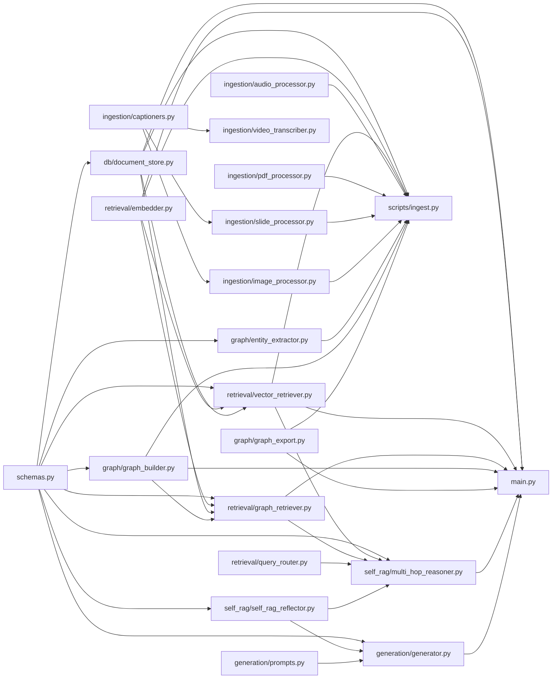

### Import summary in plain English

- **`schemas.py`** is imported by almost everything — it defines the data shapes the whole pipeline uses.
- **`main.py`** imports from every layer. It is the only file that calls `reason()` and `generate()` directly.
- **`multi_hop_reasoner.py`** is the brain of the query pipeline. It calls `route_query`, `retrieve_dense`, `retrieve_graph`, and `reflect_retrieval`.
- **`generator.py`** calls `reflect_answer` after producing an answer.
- **`graph_retriever.py`** is the only retrieval module that depends on `GraphBuilder` (it needs the live graph object, not just stored data).
- **`captioners.py`** is the only shared dependency among the three visual ingestion modules (video, slides, images).
- **`scripts/ingest.py`** mirrors what `main.py` does during `POST /api/ingest`, but runs as a standalone CLI script with no web server.
