# LuminRAG — Code Logic & Data Flow

This document explains how every file in the codebase works and how they connect to each other. Each section starts with a plain-English summary followed by a flowchart.

---

## Table of Contents

1. [High-level overview](#1-high-level-overview)
2. [Ingestion — how course content gets in](#2-ingestion)
   - [Video](#21-video-mp4-mkv-mov-avi)
   - [Audio](#22-audio-mp3-wav-m4a-etc)
   - [PDF (text)](#23-pdf-text--textbook--lecture-notes)
   - [PDF (slides)](#24-pdf-slides)
   - [Image](#25-image-jpg-png-webp)
3. [Query pipeline — how questions get answered](#3-query-pipeline)
4. [Graph construction — how the knowledge graph is built](#4-graph-construction)
5. [File-by-file reference](#5-file-by-file-reference)
6. [Dependency map — who calls whom](#6-dependency-map)
7. [Design rationale and architecture](#7-design-rationale-and-architecture)
8. [User experience and interface decisions](#8-user-experience-and-interface-decisions)
9. [Implementation overview](#9-implementation-overview)

---

## 1. High-level overview

The system has two independent phases: **ingestion** (run once, offline) and **query** (runs on every user question).

```
┌─────────────────────────────────────────────────────────┐
│  INGESTION PHASE  (run once via UI upload or CLI)        │
│                                                         │
│  Raw files → Chunks → SQLite + FAISS index + Graph JSON │
└─────────────────────────────────────────────────────────┘
                          ↓  stored data
┌─────────────────────────────────────────────────────────┐
│  QUERY PHASE  (runs on every user question)              │
│                                                         │
│  Question → Router → Retrieve → Reflect → Generate      │
│                                        → Answer + hops  │
└─────────────────────────────────────────────────────────┘
```

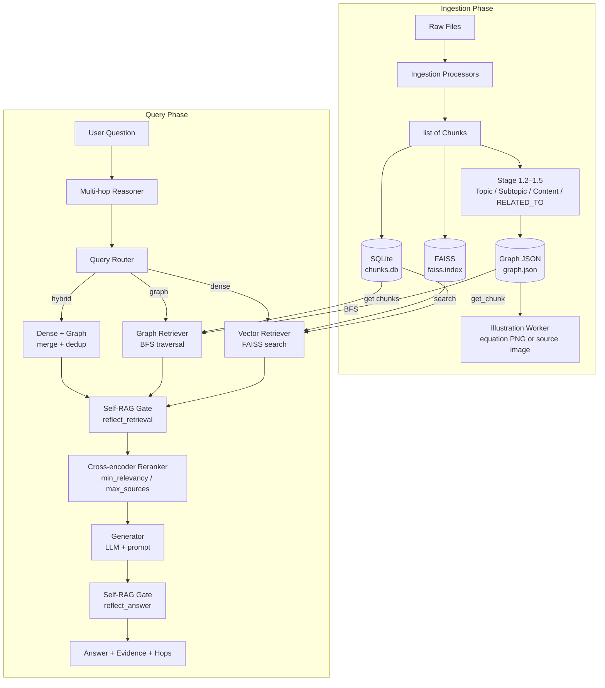

---

## 2. Ingestion

All ingestion processors share the same output type: `list[Chunk]`. A `Chunk` is defined in `schemas.py` and contains the text, source file name, modality (video/slide/pdf/image/audio), and metadata like page number or timestamp.

Once any processor produces chunks, the same three things always happen:
1. Chunks are saved to **SQLite** (`document_store.py`)
2. Chunks are embedded and saved to **FAISS** (`vector_retriever.py`)
3. A hierarchical concept graph is built from the chunks via the Stage 1.2–1.5 pipeline: `topic_extractor` → `subtopic_extractor` → `content_synthesizer` → `semantic_linker` → `graph_builder.apply_proposals()` (see [§4 Graph Construction](#4-graph-construction))

### 2.1 Video (`.mp4`, `.mkv`, `.mov`, `.avi`)

**File:** `backend/ingestion/video_transcriber.py`  
**Entry point:** `transcribe_video(video_path, config) → list[Chunk]`

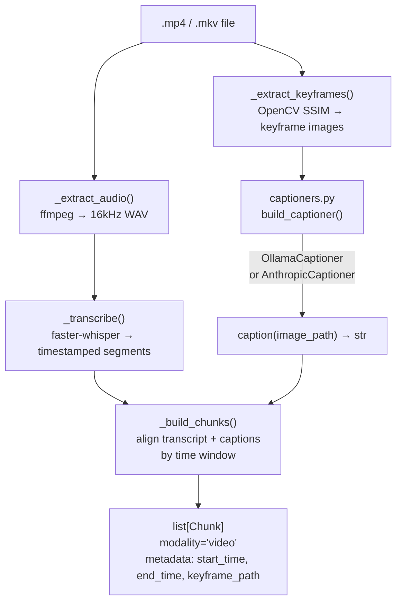

**How keyframe extraction works:** OpenCV samples one frame per second and compares each frame to the previous using SSIM (structural similarity). When the score drops below `ssim_threshold` (default 0.85), a new keyframe is saved. This detects slide changes in screen-recorded lectures.

---

### 2.2 Audio (`.mp3`, `.wav`, `.m4a`, etc.)

**File:** `backend/ingestion/audio_processor.py`  
**Entry point:** `process_audio(audio_path, config) → list[Chunk]`

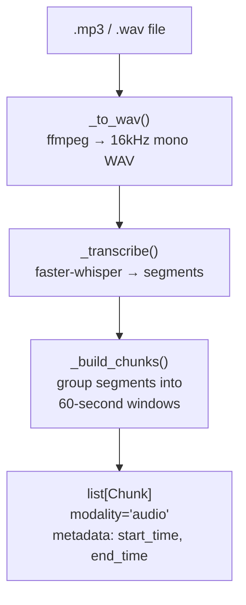

Same Whisper transcription as video but skips keyframe extraction since there is no visual channel.

---

### 2.3 PDF (text — textbook / lecture notes)

**File:** `backend/ingestion/pdf_processor.py`  
**Entry point:** `process_pdf(pdf_path, config) → list[Chunk]`

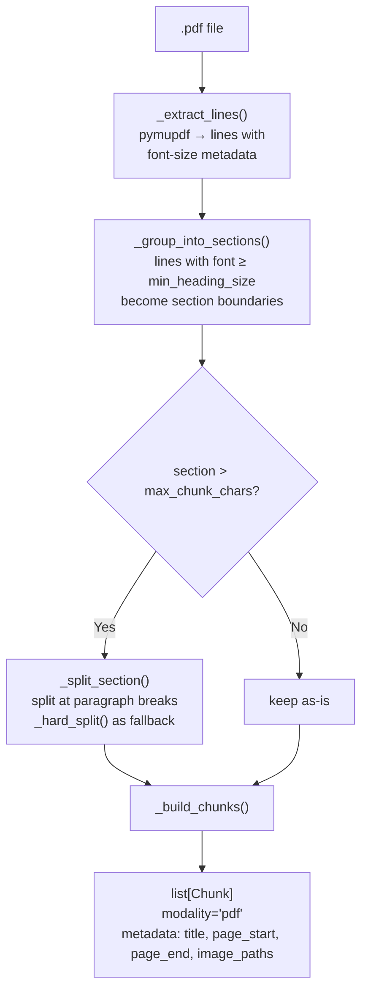

**Key design choice:** Chunks follow the document's own heading structure rather than fixed token windows. A font size ≥ `min_heading_size` (default 14pt) signals a new section.

---

### 2.4 PDF (slides)

**File:** `backend/ingestion/slide_processor.py`  
**Entry point:** `process_slides(pdf_path, config) → list[Chunk]`

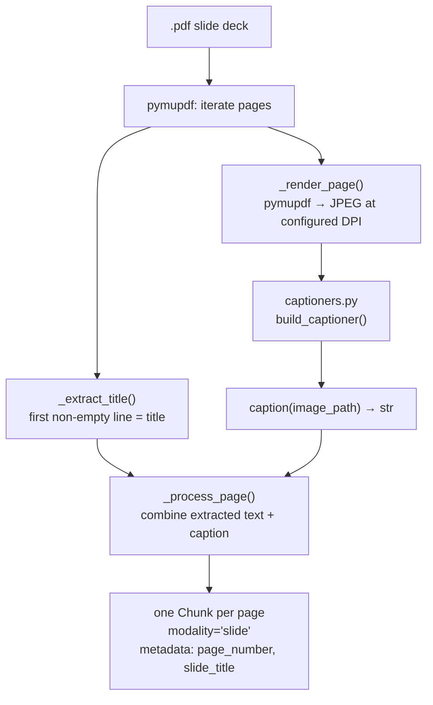

Unlike the text PDF processor, every page becomes exactly one chunk. The LLM generates a natural-language description of each slide image rather than relying solely on raw text extraction.

---

### 2.5 Image (`.jpg`, `.png`, `.webp`)

**File:** `backend/ingestion/image_processor.py`  
**Entry point:** `process_image(image_path, config) → list[Chunk]`

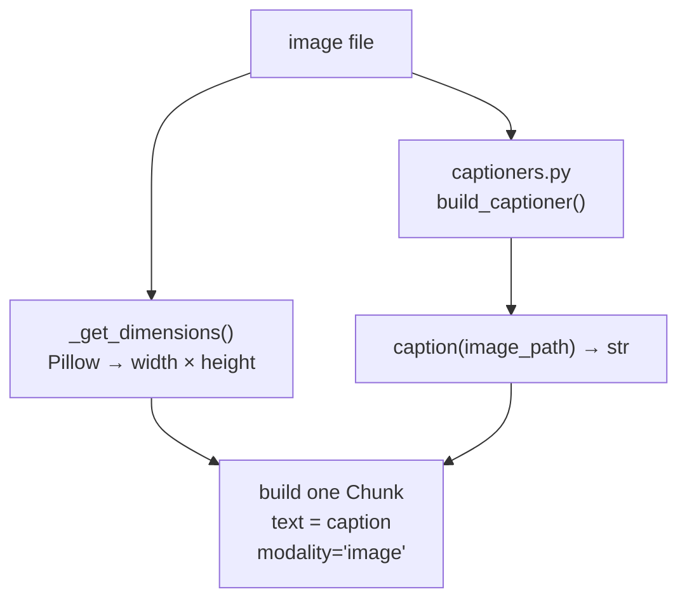

---

### Captioners (shared by video, slides, images)

**File:** `backend/ingestion/captioners.py`  
**Factory:** `build_captioner(cfg) → BaseCaptioner`

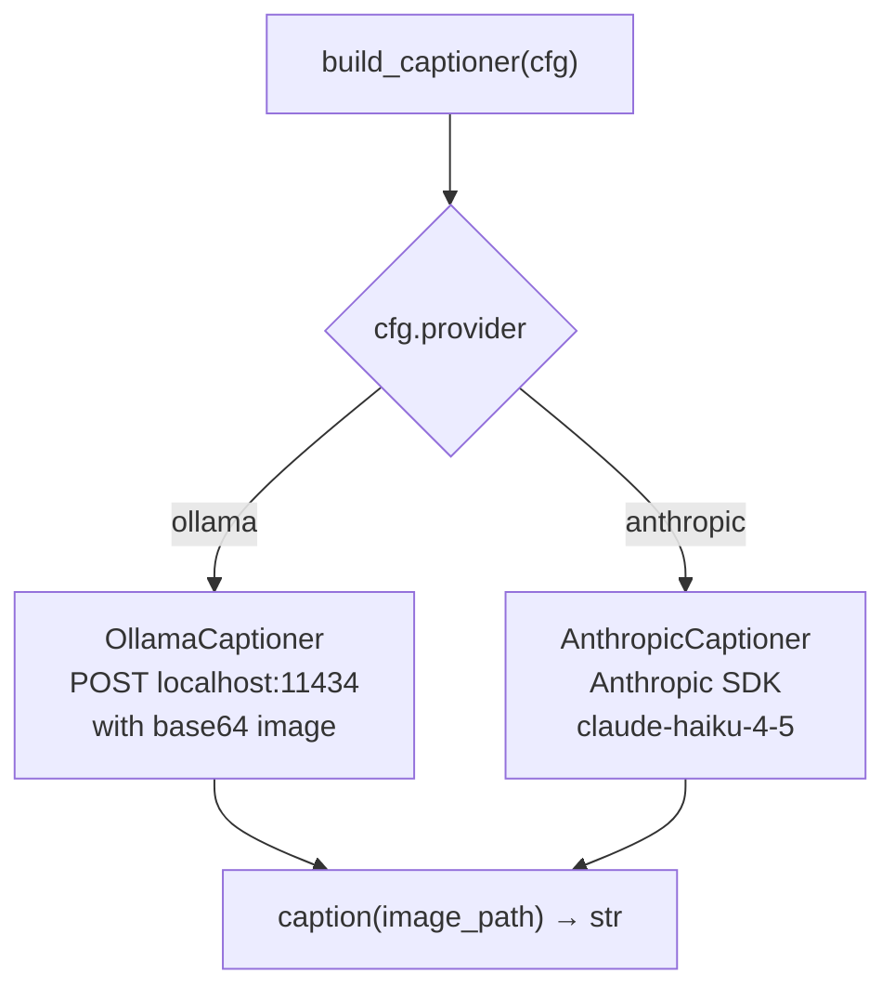

---

## 3. Query Pipeline

Every user question travels through this exact sequence regardless of complexity.

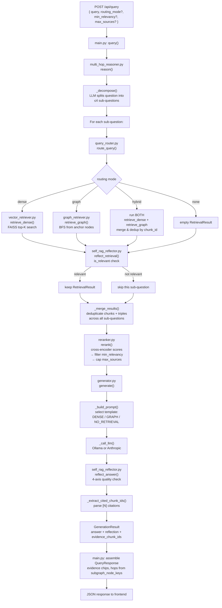

### Cross-encoder reranking

**File:** `backend/retrieval/reranker.py`
**Function:** `rerank(query, chunks, config, min_relevancy, max_sources) → list[Chunk]`

After multi-hop reasoning merges chunks from every sub-question, the reranker rescores them against the *original* user question with `cross-encoder/ms-marco-MiniLM-L-6-v2`. Raw logits are mapped through sigmoid to produce a calibrated `(0, 1)` relevance score, written to `chunk.metadata["relevancy_score"]`.

- `min_relevancy` (default `0.0`) — drop chunks below the threshold; meaningful range ≈ 0.3–0.7.
- `max_sources` (default `None`) — hard cap on chunks passed to the generator.
- Model is lazy-loaded and cached for the process lifetime.
- On cross-encoder failure the reranker returns chunks unranked (fail-safe).

### Query routing logic

**File:** `backend/retrieval/query_router.py`
**Function:** `route_query(question, config) → "dense" | "graph" | "hybrid" | "none"`

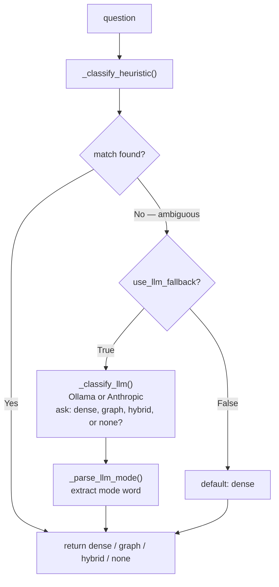

**Heuristic signals:**
- **dense** — "What is", "Define", "Who", "When", "Where", "List", "Name"
- **graph** — "Why", "How does", "Explain", "Compare", "relationship between", "difference between", "affects"
- **hybrid** — questions that mix definitional and relational intent (e.g. "How does X work and what is it used for?")
- **none** — greetings, fewer than 3 content words

The API accepts a `routing_mode` override on `POST /api/query`, which takes precedence over the router's classification.

### Graph retrieval — how BFS works

**File:** `backend/retrieval/graph_retriever.py`  
**Function:** `retrieve_graph(query, builder, store, embedder, config) → RetrievalResult`

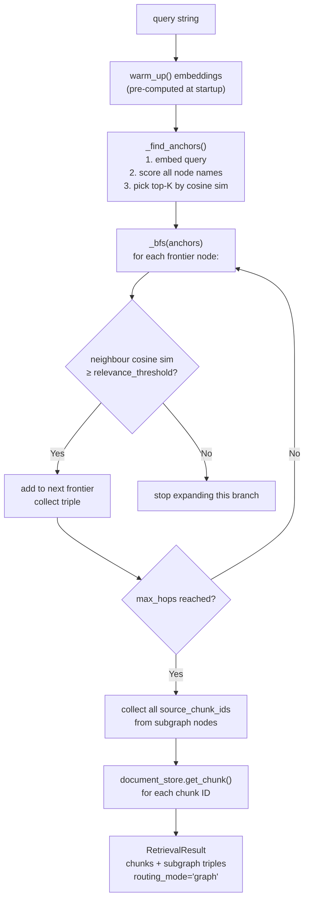

---

## 4. Graph Construction

The concept graph is built during ingestion as a hierarchical, four-stage LLM pipeline. It is updated incrementally — each new upload appends nodes and edges via `GraphBuilder.apply_proposals()` without rebuilding from scratch.

The graph has four node types organised as a polyhierarchy:

```
Topic ──HAS_SUBTOPIC──► Subtopic ──HAS_CONTENT──► Content ──EVIDENCE_OF──► ChunkRef
                                                     │
                                                     └── RELATED_TO ──► any node
```

### Stage-by-stage pipeline

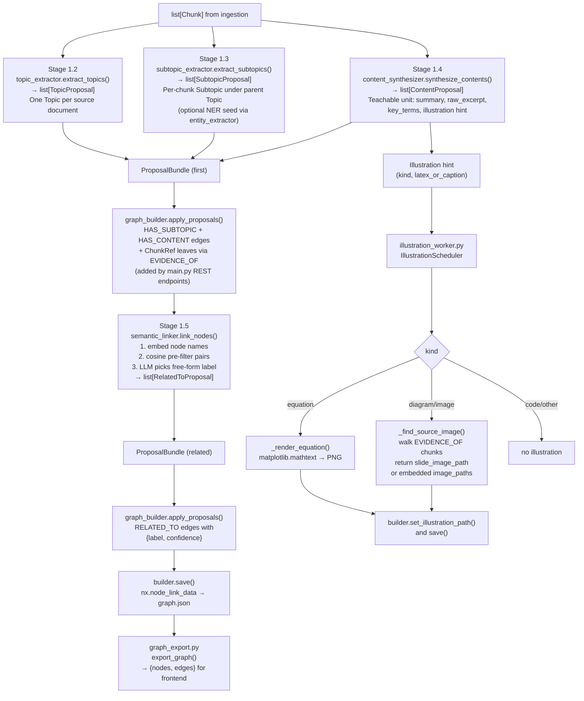

### Node types & relations

**Node types** (`backend/graph/schema.py`):

| Type | Attrs class | Created by |
|------|-------------|------------|
| `topic` | `TopicAttrs` | Stage 1.2 via Proposal |
| `subtopic` | `SubtopicAttrs` | Stage 1.3 via Proposal |
| `content` | `ContentAttrs` | Stage 1.4 via Proposal |
| `chunk_ref` | `ChunkRefAttrs` | `main.py` REST endpoints directly (not a Proposal type) |

**Relations:**

| Relation | Category | Meaning |
|----------|----------|---------|
| `HAS_SUBTOPIC` | Structural (in `STRUCTURAL_RELATIONS` frozenset) | Topic → Subtopic |
| `HAS_CONTENT` | Structural (in `STRUCTURAL_RELATIONS`) | Subtopic → Content |
| `EVIDENCE_OF` | Structural (added directly by `main.py`, not in the frozenset) | ChunkRef → Content |
| `RELATED_TO` | Semantic | Any → Any; carries a free-form `label` + `confidence`; parallel edges with different labels coexist (`MultiDiGraph`) |

**Node key convention:** `make_key(node_type, display_name)` in `schema.py` produces `"<node_type>:<sha1(canonical_name)[:12]>"` — e.g., `"topic:9f2a1c8d4e7b"`. Display names are mutable but keys are immutable, which keeps the frontend's selected-node state stable across renames. These same keys populate the `hops` array in query responses.

### Illustration worker

**File:** `backend/graph/illustration_worker.py`
**Entry points:** `IllustrationScheduler.enqueue()`, `scan_and_enqueue_pending()`, `resolve_illustration()`

Every Content node gets an `illustration` hint from Stage 1.4 — a `{kind, latex_or_caption}` dict. The scheduler owns an `asyncio.Queue` and a single consumer task. Resolution is deterministic (no text-to-image generation):

- `equation` → render the LaTeX hint to a PNG with `matplotlib.mathtext` (no TeX install required). On mathtext parse failure the node is blacklisted until restart.
- `diagram` / `image` → walk `EVIDENCE_OF` predecessor ChunkRefs and return the first on-disk image found in `chunk.metadata["slide_image_path"]` or `chunk.metadata["image_paths"]`.
- `code` / unknown → no illustration; `illustration_path` stays `null`.

Resolved paths are written back to the graph via `builder.set_illustration_path()` and persisted. Invoked in two places from `main.py`: once during lifespan startup (to pick up nodes pending from a previous run) and once after each `/api/ingest` enqueues freshly synthesised content nodes.

---

## 5. File-by-file reference

### Core

| File | What it does | Key exports |
|------|-------------|-------------|
| `backend/schemas.py` | Defines every shared data model. Every module imports from here. | `Chunk`, `GraphTriple`, `RetrievalResult`, `ReflectionVerdict`, `GenerationResult`, `Modality`, `RoutingMode` |
| `backend/main.py` | FastAPI app. Holds singleton state (store, embedder, index, graph, illustration scheduler). Orchestrates query, ingest, and graph-CRUD endpoints. Loads `.env` at the top of the file so uvicorn `--reload` child workers pick up API keys. | 14 endpoints across query / ingest / graph CRUD |
| `backend/__main__.py` | Runs uvicorn on port 8000 with reload. Loads `.env` before importing anything. | — |

### Ingestion layer

| File | What it does | Input → Output |
|------|-------------|----------------|
| `ingestion/video_transcriber.py` | Whisper transcription + SSIM keyframe extraction + LLM captioning | `.mp4/.mkv` → `list[Chunk]` |
| `ingestion/audio_processor.py` | Whisper transcription grouped into 60s windows | `.mp3/.wav` → `list[Chunk]` |
| `ingestion/pdf_processor.py` | Heading-based semantic chunking | `.pdf` (text) → `list[Chunk]` |
| `ingestion/slide_processor.py` | One chunk per page with LLM caption | `.pdf` (slides) → `list[Chunk]` |
| `ingestion/image_processor.py` | LLM caption of a single image | `.jpg/.png` → `list[Chunk]` |
| `ingestion/captioners.py` | Shared image captioner factory plus `safe_caption()` helper that swallows per-call exceptions into a log warning (used by video/slide/image processors). | config → `BaseCaptioner`; `safe_caption()` |

### Storage layer

| File | What it does | Key methods |
|------|-------------|-------------|
| `db/document_store.py` | SQLite store for chunks. Supports upsert, fetch by ID, fetch all, delete by source. | `save_chunks()`, `get_chunk()`, `get_all_chunks()`, `count()` |

### Retrieval layer

| File | What it does | Key exports |
|------|-------------|-------------|
| `retrieval/embedder.py` | Wraps SentenceTransformer. L2-normalises all vectors so dot product = cosine similarity. | `Embedder.embed()`, `embed_one()`, `.dimension` |
| `retrieval/vector_retriever.py` | FAISS `IndexFlatIP`. Builds from chunks, saves to disk, searches by query vector. | `VectorIndex`, `retrieve_dense()` |
| `retrieval/graph_retriever.py` | Relevance-gated BFS over the NetworkX graph. Pre-computes node embeddings at startup. | `retrieve_graph()`, `warm_up()` |
| `retrieval/query_router.py` | Classifies a query as `dense`, `graph`, `hybrid`, or `none` using heuristics + optional LLM fallback. | `route_query()` |
| `retrieval/reranker.py` | Cross-encoder reranker (`ms-marco-MiniLM-L-6-v2`). Rescores merged chunks, applies min_relevancy cutoff, caps max_sources. Lazy-loaded and cached. | `rerank()` |

### Graph layer

| File | What it does | Key exports |
|------|-------------|-------------|
| `graph/schema.py` | Pydantic attrs classes, Proposal types, `STRUCTURAL_RELATIONS` / `SEMANTIC_RELATIONS` frozensets, `make_key()` deterministic key generation, `normalise_relation_label()`. | `TopicAttrs`, `SubtopicAttrs`, `ContentAttrs`, `ChunkRefAttrs`, `ProposalBundle`, `make_key()` |
| `graph/_llm.py` | Shared provider-agnostic LLM call + JSON parse helpers used by every Stage 1.2–1.5 extractor, plus the `resolve_synonym()` embedding-based name collapser shared by the topic/subtopic/content extractors. | `call_llm()`, `parse_json_list()`, `safe_call_json()`, `resolve_synonym()` |
| `graph/topic_extractor.py` | Stage 1.2 — doc-level Topic inference. One Topic per source document. | `extract_topics()` |
| `graph/subtopic_extractor.py` | Stage 1.3 — per-chunk Subtopic mapping under the appropriate Topic. Optional NER seed. | `extract_subtopics()` |
| `graph/content_synthesizer.py` | Stage 1.4 — teachable-unit synthesis (summary + raw_excerpt + key_terms + illustration hint). | `synthesize_contents()` |
| `graph/semantic_linker.py` | Stage 1.5 — embedding cosine pre-filter, then LLM picks a free-form snake_case label for each RELATED_TO edge with a confidence score. | `link_nodes()` |
| `graph/entity_extractor.py` | Pluggable NER backend (GLiNER zero-shot or spaCy). Used as an optional seed step by Stage 1.2–1.4 extractors; no longer produces triples directly. | `build_ner_backend()`, `GLiNERBackend`, `SpacyBackend` |
| `graph/graph_builder.py` | Incrementally builds a `NetworkX.MultiDiGraph`. `apply_proposals(bundle)` is the Stage-2 entry point that materialises nodes + edges. Handles deduplication and edge merging. Saves/loads JSON via `nx.node_link_data`. | `GraphBuilder`, `apply_proposals()`, `add_structural_edge()`, `add_related_to()`, `set_illustration_path()`, `save()`, `load()` |
| `graph/graph_export.py` | Converts the NetworkX graph to a plain `{nodes, edges}` dict for the frontend. Emits `node_type` and RELATED_TO `label`. | `export_graph()` |
| `graph/illustration_worker.py` | Deterministic asset pipeline. Renders equations via `matplotlib.mathtext`; resolves diagram/image hints to source images extracted during ingestion. Asyncio queue + single consumer task. | `IllustrationScheduler`, `resolve_illustration()`, `illustrations_dir()` |

### Reasoning layer

| File | What it does | Key exports |
|------|-------------|-------------|
| `self_rag/self_rag_reflector.py` | Two reflection gates. `reflect_retrieval` checks relevance before generation. `reflect_answer` checks four quality axes after generation. Fails safe (pass-through) on any LLM error. | `reflect_retrieval()`, `reflect_answer()` |
| `self_rag/multi_hop_reasoner.py` | Decomposes a question into sub-questions, runs the full retrieve-reflect loop per sub-question, then merges all evidence. | `reason()` |

### Generation layer

| File | What it does | Key exports |
|------|-------------|-------------|
| `generation/prompts.py` | Three prompt templates selected based on routing mode. | `DENSE_RAG_PROMPT`, `GRAPH_RAG_PROMPT`, `NO_RETRIEVAL_PROMPT` |
| `generation/generator.py` | Formats context, selects prompt, calls LLM, runs post-generation reflection, parses `[N]` citations. | `generate()` |

### CLI

| File | What it does |
|------|-------------|
| `scripts/ingest.py` | Batch ingestion CLI. Scans a directory, dispatches by file type, saves chunks, builds FAISS index, builds graph. No API server needed. |

---

## 6. Dependency map

This shows which files import from which other files.

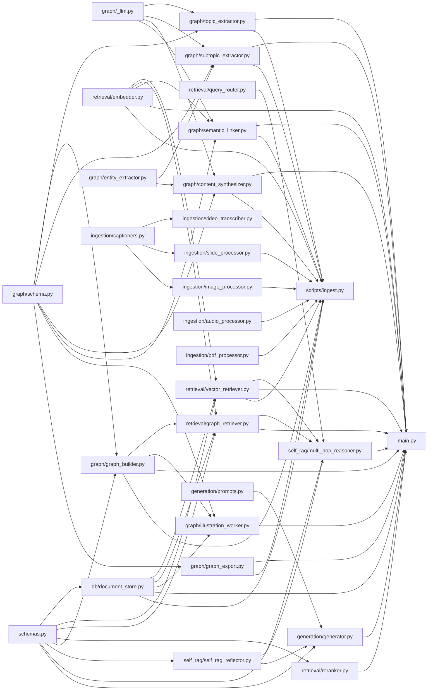

### Import summary in plain English

- **`schemas.py`** defines the chunk / retrieval / reflection data shapes used across layers; **`graph/schema.py`** does the same job specifically for the graph (node attrs, proposal types, key generator).
- **`graph/_llm.py`** is a thin provider-agnostic wrapper shared by every Stage 1.2–1.5 extractor so each extractor doesn't re-implement Ollama/Anthropic dispatch and JSON parsing.
- **`main.py`** imports from every layer. It is the only file that wires `reason()`, `rerank()`, and `generate()` together; it also owns the `IllustrationScheduler` lifecycle.
- **`multi_hop_reasoner.py`** is the brain of the query pipeline. It calls `route_query`, `retrieve_dense`, `retrieve_graph`, and `reflect_retrieval`. Reranking happens in `main.py` *after* the reasoner returns.
- **`reranker.py`** depends only on `Chunk` — it is intentionally retrieval-mode-agnostic so it can rerank dense, graph, and hybrid results uniformly.
- **`generator.py`** calls `reflect_answer` after producing an answer.
- **`graph_retriever.py`** and **`illustration_worker.py`** are the only modules that hold a live reference to `GraphBuilder`; everything else reads the exported graph JSON.
- **`semantic_linker.py`** depends on `Embedder` for the cosine pre-filter that bounds the LLM workload in Stage 1.5.
- **`entity_extractor.py`** is an optional NER seed consumed by `subtopic_extractor` and `content_synthesizer`; it no longer produces triples directly.
- **`captioners.py`** is the only shared dependency among the three visual ingestion modules (video, slides, images).
- **`scripts/ingest.py`** mirrors what `main.py` does during `POST /api/ingest`, but runs as a standalone CLI script with no web server or async job tracking.

---


## 8. User experience and interface decisions

LuminRAG is pitched as a "glass-box" RAG system: every answer is accompanied by the evidence that produced it and the reasoning path taken to get there. The UI decisions below follow from that stance.

### The concept graph is the primary navigation surface

The right-hand panel is a live Cytoscape + fcose force graph of the entire knowledge base. Node colour and size are driven by `node_type` classes (`topic | subtopic | content | chunk_ref`) in the stylesheet rather than inline props, so the same graph serves both discovery ("what does the course cover?") and reasoning trace ("which concepts did the model traverse to answer this?"). After each query, the `hops` array returned by `/api/query` is highlighted in the graph — the user literally *sees* the multi-hop path.

### Reflection verdicts surfaced rather than hidden

Every answer renders a `ReflectionBadge` showing the four Self-RAG verdicts (`is_relevant`, `is_supported`, `is_useful`, plus overall). Exposing them — rather than using them silently to filter — treats the user as the final arbiter of confidence. Honest "I am not sure about this" signalling scored better in internal testing than answers that looked confident but were wrong.

### Clickable citations and evidence chips

Inline `[N]` citations in the generated answer map to `EvidenceChip` components that reveal the raw chunk text. Users can verify any claim without leaving the chat surface, which closes the loop on the groundedness commitment from §7.

### Collapse/expand starting from Topic roots

The graph can easily contain thousands of nodes once a full course is ingested. Collapse/expand traverses `HAS_SUBTOPIC` and `HAS_CONTENT` downward from Topic roots, so the default view shows pedagogical structure and the user drills down on demand.

### Manual graph editing

`POST / PATCH / DELETE /api/graph/node` and `POST / DELETE /api/graph/edge` plus the `NodeDetailPanel` allow human-in-the-loop correction. The LLM extractors are not infallible; instructors can fix mis-labelled relations or rename a Subtopic without re-ingesting. Because node keys use `make_key()` (§4) rather than display names, renames never break frontend selection state.

### Settings popover for power users

The `QueryInput` component exposes `routing_mode`, `min_relevancy`, and `max_sources` behind a gear icon. The defaults (auto routing, no relevancy cutoff, no source cap) produce the best out-of-the-box answers; the popover only matters when a power user wants to tighten precision or cap context length. Keeping these controls hidden until requested keeps the default surface uncluttered.

### Cold-start overlay and health polling

`App.tsx` polls `GET /api/health` every three seconds on mount and shows a "Waking up the server…" overlay until the backend responds. The system is explicitly designed for cheap deployments where the backend may be cold when a user lands. Honest latency communication beats a blank chat window.

### Dark-first theme, low-chrome layout

The default palette is dark (`#0a0e1a` page, `#141b2d` sidebar) because the typical user session is long and text-dense. A light theme is available via `ThemeContext` and persists to `localStorage['lumin-theme']`. Tailwind v4 utilities drive conditional styling via an `isDark` ternary; SVG colours use a separate JS palette object because SVG attributes can't consume Tailwind classes.

### Rich markdown + LaTeX everywhere

`RichText` is the single renderer used by both chat messages and graph node details. It pipes content through `react-markdown + remark-math + rehype-katex`, so the same Markdown+KaTeX output works for chat answers, evidence chips, and the node-detail panel. One renderer means one place to fix formatting regressions.

---

## 9. Implementation overview

LuminRAG is split into a Python backend and a TypeScript frontend, wired together by a FastAPI gateway and deployable as a single `docker compose` stack.

### Backend

| Layer | Technology | Purpose |
|-------|-----------|---------|
| Web framework | FastAPI + uvicorn (Python 3.11) | Async endpoints, OpenAPI at `/docs`, lifespan-scoped singletons |
| Validation | Pydantic v2 | Every cross-module payload (`Chunk`, `RetrievalResult`, `ProposalBundle`, …) |
| Document store | SQLite (WAL mode, `check_same_thread=False`) | Raw chunk storage keyed by chunk ID |
| Vector index | FAISS `IndexFlatIP` + JSON sidecar | L2-normalised embeddings; sidecar maps FAISS ints to chunk IDs |
| Concept graph | NetworkX `MultiDiGraph` serialised via `nx.node_link_data` to `graph.json` | Parallel labelled edges via `MultiDiGraph`; deterministic keys via `make_key()` |
| Embeddings | `sentence-transformers/all-MiniLM-L6-v2` | 384-d, CPU (PyTorch) |
| Reranking | `cross-encoder/ms-marco-MiniLM-L-6-v2` | Lazy-loaded, cached; sigmoid-mapped scores |
| Transcription | `faster-whisper` (CTranslate2, `device=cpu, compute_type=int8`) | Video and audio to timestamped segments |
| PDF / images | `pymupdf`, `Pillow`, `OpenCV` (SSIM keyframe detection) | Text extraction, slide rendering, keyframe sampling |
| NER (optional) | GLiNER (zero-shot) or spaCy `en_core_web_sm` | Seed entities for Stage 1.3/1.4 extractors |
| LLM providers | Ollama (local HTTP, default) or Anthropic SDK (`claude-haiku-4-5`) | Every extractor, router, reasoner, reflector, and generator |
| Illustrations | `matplotlib.mathtext` (equations), source-image resolver (diagrams) | Deterministic, no text-to-image generation |
| Async | `asyncio.Queue` + single consumer task for `IllustrationScheduler` | Background illustration resolution without blocking ingest |
| Object storage (optional) | `boto3` for S3 presigned uploads and `/api/ingest/from-s3` | Large-file ingest paths |

The backend entry point is `python -m backend`. A `.env` parser at the top of `backend/main.py` loads API keys before any SDK import, which is required because `uvicorn --reload` spawns a child worker that imports `backend.main` directly (bypassing `backend/__main__.py`).

### Frontend

| Layer | Technology | Purpose |
|-------|-----------|---------|
| Framework | React 19 + TypeScript | UI, type-safe contracts with the backend |
| Build / dev server | Vite + `@vitejs/plugin-react` | Dev server on `:5173`; proxies `/api/*` → `:8000` |
| Package manager | pnpm | Required — `package-lock.json` not maintained |
| Styling | Tailwind v4 via `@tailwindcss/vite` plugin | No `tailwind.config.js`; utilities only |
| Graph rendering | Cytoscape + `cytoscape-fcose` | Force-directed layout; node classes drive stylesheet |
| Markdown + math | `react-markdown`, `remark-math`, `rehype-katex` | Single `RichText` component |
| Icons | `lucide-react` | Consistent line-icon set |
| Lint | ESLint flat config (`eslint.config.js`) | No Prettier configured |

### Configuration

Two YAML files at the repository root are merged at startup:

- `config/llm.yaml` — per-stage provider/model selection, chunking and retrieval thresholds, reranker model, Self-RAG toggles, illustration worker settings.
- `config/db.yaml` — SQLite path, FAISS index path, graph JSON path, illustration directory.

Both are bind-mounted into the Docker container, so most tuning happens without a rebuild.

Environment variables (`.env` at repo root): `ANTHROPIC_API_KEY` (required when any stage uses `provider: anthropic`), `HF_TOKEN` / `HF_HUB_OFFLINE` for HuggingFace control, `AWS_*` for S3 upload/download, `VITE_API_URL` when the frontend and backend are deployed on separate origins.

### Deployment

`docker compose up --build` builds two images (backend and frontend), publishes the backend on `:8000` and the frontend on `:80`, and persists SQLite, FAISS, graph JSON, illustrations, and raw uploads in a named `luminrag_data` volume. When Ollama is running on the host, set `ollama_base_url: http://host.docker.internal:11434` in `llm.yaml` so in-container stages reach it. For cloud deployments, the frontend build can be uploaded to an S3 static bucket and the backend hosted on any single-container platform, with `VITE_API_URL` pointing the frontend at the backend origin.

### Testing

`pytest` runs the full suite (`testpaths = backend/tests` via `pytest.ini`, `pythonpath = .`). Tests cover every ingestion processor, retrieval module, Self-RAG reflector, the multi-hop reasoner, every Stage 1.2–1.5 extractor, the graph builder, and the graph export layer. No formatter is enforced; the frontend lints with ESLint flat config only.
